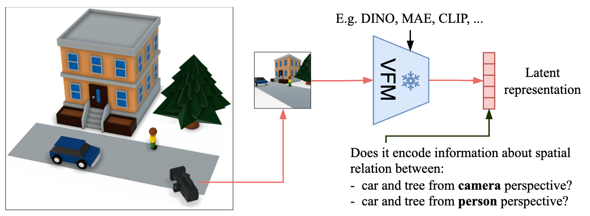
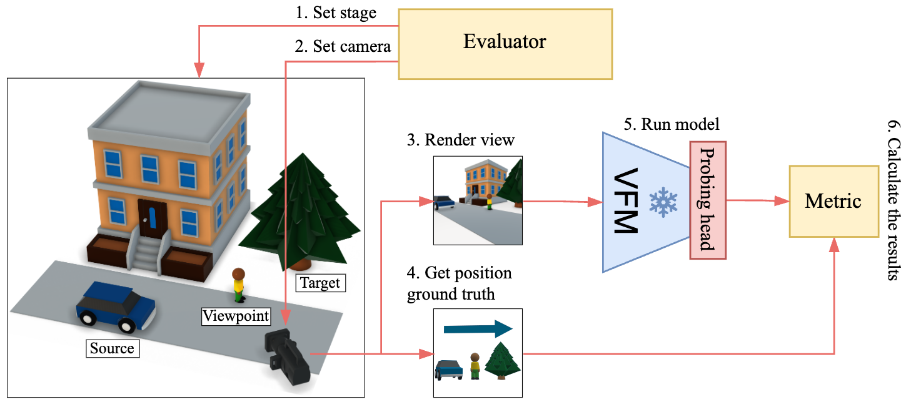

# SpaRRTa: A Synthetic Benchmark for Evaluating Spatial Intelligence in Visual Foundation Models

Official implementation of **SpaRRTa**, a synthetic benchmark that probes whether Visual
Foundation Models (VFMs) — such as DINO, DINOv2/v3, MAE, CroCo, VGGT, SPA and CLIP — encode
the **spatial relations between objects** in a scene.

Unlike conventional 3D probing tasks that target metric quantities (depth, pose), SpaRRTa
measures a more fundamental capability: recognizing the *relative direction* (Front / Back /
Left / Right) of a target object with respect to a reference object, from a given viewpoint.

<p align="center">
  
</p>

> Turhan Can Kargın, Wojciech Jasiński, Adam Pardyl, Bartosz Zieliński, Marcin Przewięźlikowski.
> *SpaRRTa: A Synthetic Benchmark for Evaluating Spatial Intelligence in Visual Foundation Models.*
> [arXiv:2601.11729](https://arxiv.org/abs/2601.11729)

---

## The task

SpaRRTa is a 4-way classification problem (**Front / Back / Left / Right**) with two variants:

- **SpaRRTa-ego (egocentric)** — directions are defined from the *camera's* viewpoint.
- **SpaRRTa-allo (allocentric)** — directions are defined from a *human figure's* viewpoint
  in the scene, which requires implicit perspective-taking.

The benchmark is rendered in Unreal Engine 5 across five environments (Forest, Desert,
Winter Town, Bridge, City), and is complemented by a small **real-world** set photographed with
lego figures for sim-to-real evaluation.

The overall data-generation and probing pipeline is summarized below:

<p align="center">
  
</p>

## Probing strategies

A frozen backbone produces patch (and CLS) tokens; only a lightweight probe head is trained.
Three heads are provided (`sparrta/models/probes.py`):

| Head | Config target | Description |
|------|---------------|-------------|
| `ClassificationHead` | `sparrta.models.probes.ClassificationHead` | Linear probe on pooled features (GAP / CLS). |
| `ABMILPHead` | `sparrta.models.probes.ABMILPHead` | Attention-based multiple-instance pooling over patches. |
| `EfficientProbing` | `sparrta.models.probes.EfficientProbing` | Multi-query cross-attention aggregation (strongest). |

A central finding of the paper: spatial information lives in the **patch tokens**, so attention
probes (`EfficientProbing` > `ABMILPHead`) substantially outperform a linear probe on pooled features.

## Backbones

All 15 backbones from the paper are supported via Hydra configs in `configs/backbone/`:

| Config | Works out of the box | Notes |
|--------|:---:|-------|
| `dino_b16`, `dinov2_b14`, `dinov2_b14_reg`, `dinov2_l14_reg` | ✅ | `torch.hub` |
| `dinov3_timm` | ✅ | timm / Hugging Face |
| `mae_b16` | ✅ | Hugging Face `transformers` |
| `clip_b16_laion` | ✅ | `open_clip` |
| `deit3_b16` | ✅ | timm |
| `maskfeat_vitb16` | ⚠️ | needs `mmselfsup`/`mmcls` (see below) |
| `vggt_l16` | 🔧 | needs the external [VGGT](https://github.com/facebookresearch/vggt) repo → `$VGGT_REPO` |
| `spa_b16`, `spa_l16` | 🔧 | needs the external [SPA](https://github.com/HaoyiZhu/SPA) repo → `$SPA_REPO` |
| `croco_b16`, `crocov2_b16` | 🔧 | needs the external [CroCo](https://github.com/naver/croco) repo → `$CROCO_REPO` |
| `dinov3_b16` | 🔧 | needs the external [DINOv3](https://github.com/facebookresearch/dinov3) repo → `$DINOV3_REPO` and weights → `$DINOV3_WEIGHTS` |

Backbones marked 🔧 are loaded lazily: they only error (with a clear message) if you actually
select them without setting the corresponding environment variable. For the local DINOv3 you
can avoid all of this by using `backbone=dinov3_timm` instead.

> Want to probe a model that isn't listed? See [**Adding your own model**](#adding-your-own-model).

## Adding your own model

SpaRRTa probes a **frozen** backbone, so adding a new model means writing a thin wrapper that
exposes its features in the format the probe heads expect — no training-loop changes required.
Once your wrapper reports its feature dimension, **all three probe heads
(`ClassificationHead` / `ABMILPHead` / `EfficientProbing`) work automatically.**

Adding a model is two steps: **(1)** a wrapper module under `sparrta/models/`, and
**(2)** a Hydra config under `configs/backbone/`.

### 1. The interface contract

Your backbone is a `torch.nn.Module` that is instantiated by Hydra (`instantiate(cfg.backbone)`)
and then frozen (`requires_grad_(False)`). It must provide:

**Attributes** (set in `__init__`):

| Attribute | Type | Purpose |
|-----------|------|---------|
| `self.feat_dim` | `int` (or `list[int]` for multilayer) | Per-token channel dim `C`. The probe head is built with this. |
| `self.patch_size` | `int` | Patch size in pixels (used for padding and attention-map plotting). |
| `self.checkpoint_name` | `str` | Short id used to name the feature cache. Make it unique per weights. |
| `self.layer` | `str` | Which block(s) were read; used in the cache path. |
| `self.output` | `str` | One of `cls` / `gap` / `dense` / `dense-cls`; used in the cache path. |

**`forward(images)`** receives a `[B, 3, H, W]` batch and must honor the three pooling flags
that are passed in from the config:

| Flag (config) | Expected return | Shape |
|---------------|-----------------|-------|
| `efficient_probe=True` | token sequence, **CLS first then patches** | `[B, 1 + N, C]` |
| `return_cls=True`, `mean_pool=False` | CLS token | `[B, C]` |
| `mean_pool=True`, `return_cls=False` | mean over patch tokens | `[B, C]` |
| `mean_pool=True`, `return_cls=True` | mean over all tokens | `[B, C]` |

> The feature extractor flattens any output with >2 dims to `[B, -1]` before caching; the
> attention heads reshape it back to `[B, 1+N, C]` using `feat_dim`. This is why `feat_dim`
> must be the **per-token** channel dim `C` (not `(1+N)·C`).

The easiest way to get this exactly right is to copy an existing wrapper —
[`sparrta/models/dinov3_timm.py`](sparrta/models/dinov3_timm.py) (timm) or
[`sparrta/models/mae.py`](sparrta/models/mae.py) (Hugging Face) — and swap in your model.

### 2. A minimal, self-contained wrapper (timm)

This needs no external repo — `timm` is already a dependency. Save as
`sparrta/models/mymodel.py`:

```python
import torch
import torch.nn as nn
from .utils import center_padding, tokens_to_output


class MyModel(nn.Module):
    def __init__(
        self,
        model_name: str = "vit_base_patch16_224.augreg2_in21k_ft_in1k",
        output: str = "dense",
        layer: int = -1,
        return_cls: bool = False,
        mean_pool: bool = False,
        efficient_probe: bool = False,
        pretrained: bool = True,
    ):
        super().__init__()
        import timm

        self.output = output
        self.return_cls = return_cls
        self.mean_pool = mean_pool
        self.efficient_probe = efficient_probe

        self.vit = timm.create_model(model_name, pretrained=pretrained).eval().to(torch.float32)

        # --- required metadata ---
        ps = self.vit.patch_embed.patch_size
        self.patch_size = int(ps[0] if isinstance(ps, (tuple, list)) else ps)
        self.feat_dim = int(getattr(self.vit, "num_features", self.vit.embed_dim))  # per-token C
        self.checkpoint_name = f"mymodel_{model_name}"

        num_layers = len(self.vit.blocks)
        chosen = (num_layers - 1) if layer == -1 else int(layer)
        self.multilayers = [chosen]
        self.layer = str(chosen)

    def forward(self, images):
        images = center_padding(images, self.patch_size)
        h, w = images.shape[-2:]
        h, w = h // self.patch_size, w // self.patch_size
        num_spatial = h * w

        # tokens through the network (timm handles cls/pos embeds in _pos_embed)
        x = self.vit.patch_embed(images)
        x = self.vit._pos_embed(x)
        for i, blk in enumerate(self.vit.blocks):
            x = blk(x)
            if i == self.multilayers[0]:
                break

        spatial = x[:, -num_spatial:]          # patch tokens (robust to register tokens)
        cls_tok = x[:, 0]                       # CLS token
        tokens = torch.cat([x[:, :1], spatial], dim=1)   # [B, 1+N, C]

        if self.efficient_probe:
            return tokens
        if self.return_cls and not self.mean_pool:
            return cls_tok
        if self.mean_pool and not self.return_cls:
            return tokens[:, 1:].mean(dim=1)
        if self.mean_pool and self.return_cls:
            return tokens.mean(dim=1)
        return tokens_to_output(self.output, spatial, cls_tok, (h, w))
```

Then add `configs/backbone/mymodel.yaml`:

```yaml
_target_: sparrta.models.mymodel.MyModel
model_name: vit_base_patch16_224.augreg2_in21k_ft_in1k
output: dense
layer: -1
return_cls: false
mean_pool: false
efficient_probe: false
```

That's it — you can now run `backbone=mymodel`.

### 3. Loading from Hugging Face `transformers`

If your model ships as a `transformers` checkpoint, load it in `__init__` instead of `timm`
(see [`sparrta/models/mae.py`](sparrta/models/mae.py)):

```python
from transformers import AutoModel
self.vit = AutoModel.from_pretrained(model_name).eval()
# expose self.feat_dim = self.vit.config.hidden_size, self.patch_size, etc.
```

The rest of the wrapper (the `forward` shapes and the required attributes) is identical.

### 4. Models that live in their own repo

For a model whose code is **not** pip-installable (the VGGT / SPA / CroCo pattern), gate the
import behind an environment variable using the `require_external_repo` helper so that the rest
of SpaRRTa keeps working when the repo is absent
(see [`sparrta/models/vggt.py`](sparrta/models/vggt.py)):

```python
from .util import require_external_repo

class MyExternalModel(nn.Module):
    def __init__(self, repo_dir: str = "", ...):
        super().__init__()
        require_external_repo(
            repo_dir, "MYMODEL_REPO", "MyModel", "https://github.com/you/mymodel"
        )
        import sys; sys.path.append(repo_dir)
        from mymodel import build_model   # import only after the guard
        ...
```

and reference the env var from the config:

```yaml
_target_: sparrta.models.myexternal.MyExternalModel
repo_dir: ${oc.env:MYMODEL_REPO,""}
```

Selecting this backbone without `$MYMODEL_REPO` set then raises a clear, actionable error
instead of an `ImportError` deep in the stack.

### 5. Run it

```bash
# sanity-check the resolved config first
python train.py --cfg job backbone=mymodel dataset=unreal_position

# probe it (egocentric task, forest environment)
python train.py \
  backbone=mymodel \
  dataset=unreal_position \
  probe=classifier probe._target_=sparrta.models.probes.EfficientProbing \
  dataset.perspective=camera \
  environment=forest
```

To include it in a sweep, just add `"mymodel"` to the `models` list in
[`scripts/run_sweep.py`](scripts/run_sweep.py).

## Installation

```bash
conda create -n sparrta python=3.9 --yes
conda activate sparrta
# Install PyTorch for your CUDA version (see https://pytorch.org), e.g.:
conda install pytorch=2.2.1 torchvision=0.17.1 pytorch-cuda=12.1 -c pytorch -c nvidia

pip install -e .
```

Optional, only for `maskfeat_vitb16`:

```bash
pip install -U openmim && mim install mmcv mmcls "mmselfsup>=1.0.0rc0"
```

## Data

The datasets are **not** bundled with the code. Download them from Hugging Face:

- 🧩 **Synthetic (Unreal):** https://huggingface.co/datasets/turhancan97/SpaRRTa
- 🧱 **Real-world (lego):** https://huggingface.co/datasets/turhancan97/SpaRRTa-Lego

The lego set ships in Hugging Face ImageFolder layout, so downloading it reproduces the
`train/{front,back,left,right}/*.jpg` structure expected below:

```bash
huggingface-cli download turhancan97/SpaRRTa-Lego --repo-type dataset --local-dir ./hf_SpaRRTa-Lego
export SPARRTA_LEGO_ROOT=$(pwd)/hf_SpaRRTa-Lego/train
```

Then point the code at the data via environment variables:

```bash
export SPARRTA_DATA_ROOT=/path/to/sparrta/unreal   # Unreal environments live here
export SPARRTA_LEGO_ROOT=/path/to/sparrta/lego      # real-world lego images
export SPARRTA_CACHE_DIR=./cache                    # cached frozen features (created on demand)
export SPARRTA_MODELS_DIR=~/.cache/sparrta/models   # downloaded backbone weights
```

### Expected on-disk layout

**Unreal (`$SPARRTA_DATA_ROOT`)** — one folder per environment, each holding image/annotation pairs:

```
$SPARRTA_DATA_ROOT/
  forest/mid-objects/
    img_0001.jpg
    params_0001.json
    ...
  desert/mid-objects/
  winter_town/mid-objects/
  bridge/mid-objects/
  city/mid-objects/
```

Each `params_*.json` stores the 3D positions used to compute the ground-truth direction:

```json
{
  "camera": { "location": { "x": 0.0, "y": 0.0 } },
  "actors": {
    "0": { "label": "Rock", "location": { "x": 1.0, "y": 2.0 } },
    "1": { "label": "Tree", "location": { "x": 3.0, "y": 4.0 } },
    "2": { "label": "Human", "location": { "x": 5.0, "y": 6.0 } }
  }
}
```

**Real-world lego (`$SPARRTA_LEGO_ROOT`)** — one folder per class:

```
$SPARRTA_LEGO_ROOT/
  front/  *.jpg
  back/   *.jpg
  left/   *.jpg
  right/  *.jpg
```

## Quick start

Train an `EfficientProbing` head on DINO features for the egocentric task in the forest environment:

```bash
python train.py \
  backbone=dino_b16 \
  dataset=unreal_position \
  probe=classifier probe._target_=sparrta.models.probes.EfficientProbing \
  dataset.perspective=camera \
  environment=forest
```

Switch the allocentric (human-perspective) task with `dataset.perspective=human`, and try other
backbones with `backbone=mae_b16`, `backbone=clip_b16_laion`, `backbone=dinov3_timm`, etc.
Results are appended to a CSV under `output_dir` (default `result/`).

Inspect a fully-resolved config without running anything:

```bash
python train.py --cfg job backbone=dino_b16 dataset=unreal_position
```

## Experiments & scripts

| Script | Purpose |
|--------|---------|
| `scripts/run_sweep.py` | Run a grid of backbones × layers (configured via `scripts/position_config.yaml` and env vars `PERSPECTIVE`, `ENVIRONMENT`, `PROBE_TYPE`). |
| `scripts/run_sweep_simple.py` | Minimal single-perspective launcher for quick tests. |
| `scripts/run_loto_fewshot.py` | Leave-one-environment-out transfer + few-shot adaptation matrix. |
| `scripts/run_lego_rebuttal.py` | Real-world (lego) sim-to-real evaluation matrix. |
| `scripts/summarize_loto_fewshot.py` | Aggregate LOTO/few-shot result CSVs into tables and plots. |
| `scripts/summarize_lego_rebuttal.py` | Aggregate real-world (lego) result CSVs. |
| `scripts/count_position_probe_params.py` | Report trainable parameter counts per probe head. |
| `scripts/slurm/*.sh` | SLURM batch wrappers (edit the conda activation lines for your cluster). |

### Transfer protocols

The training script supports three `protocol` values:

- `default` — standard train/val/test split within one environment.
- `loto_source_to_target` — train/val on non-holdout environments, test on the holdout one.
- `target_only` — train/val/test on the holdout environment (used for few-shot adaptation).

## Citation

```bibtex
@article{kargin2026sparrta,
  title   = {SpaRRTa: A Synthetic Benchmark for Evaluating Spatial Intelligence in Visual Foundation Models},
  author  = {Karg{\i}n, Turhan Can and Jasi{\'n}ski, Wojciech and Pardyl, Adam and Zieli{\'n}ski, Bartosz and Przewi{\k{e}}{\'z}likowski, Marcin},
  journal = {arXiv preprint arXiv:2601.11729},
  year    = {2026}
}
```

## License

Released under the [MIT License](LICENSE).
